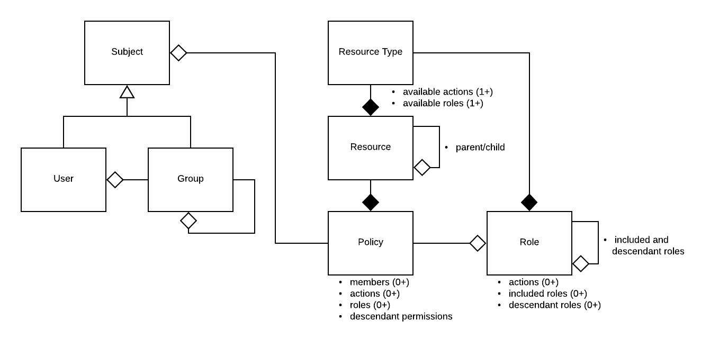

# Sam - Identity and Access Management (IAM)


## In a nutshell
The crux of IAM in Sam is a policy. A policy says **who** can **do what** to a **thing**. More technically the who is called a **subject** and can be a user or a group of users, the do what is called an **action** such as read or update, and the thing is called a **resource** such as a workspace or project. Resources have types which specify what actions are available for its resources, roles (which are collections of actions) and which role is the "owner" role. The "owner" role should have the appropriate actions to administer a resource. When a resource is created a policy with the owner role is automatically created and the creator is added.

## Terms
* Subject - an authenticated user or group
* Resource - something to which access is controlled
* Action - may be performed on a resource - meant to be as granular as possible
* Policy - represents the actions a subject may perform on a resource
* Role - a collection of actions - meant to aggregate actions into a more meaningful, higher level concept
* Group - a group of subjects (this can include groups)
* Resource type - defines a class of resources. Each resource has a type which defines
  * Available actions
  * Available roles and actions for each role
  * Of the available roles which is the “owner” role - this is used when creating a resource to give the creator ownership access

## Requirements

### Guiding Principles
There are no special/super users in this system. All api calls authenticate as subjects with access rights determined by policies in the same way. In other words, this system should use its own policy mechanisms internally for any authorization needs. (Note that this does leave the problem of bootstrapping, i.e. how is the first user created, which can be achieved by scripts outside the system with direct data store level access.)
This system can be publicly facing. This does not mean that it will be in all cases but it should be designed with this in mind.
Authentication is handled at a higher level than this application, e.g. via OAuth and an OIDC proxy.

### Evaluation
Evaluation is the act of determining what a user may access.
1. Given a user, resource and action emit a yes or no response, i.e. can the user perform the action on the resource? 
1. Given a user and a resource type, list all resources and associated roles the user has (directly or indirectly).
1. Given a user and resource, list all the actions the user may perform on that resource
1. Given a user and resource, list all the user’s roles on that resource

Of these 1 and 2 are the most important from a performance standpoint. Expect 1 to be called for almost every api call in a system. Expect 2 to be called from UI list pages where users generally want a snappy response.

### Resource and Policy Management
A resource may be part of a hierarchy of resources. A parent may be set on a resource. To do so, users must have the set_parent action on the resource and the add_child action on the would be parent. Ancestor resources in the hierarchy control permissions on all descendants. 

A policy is specific to a resource and a resource may have multiple policies. Each policy consists of 
* A set of subjects 
* A set of actions directly applicable to the resource
* A set of roles directly applicable to the resource
* A set of descendant permissions - roles and actions applicable to descendant resources
All of the subjects may perform all of the actions/roles in the policy. A policy may also be marked as public effectively meaning all users are members. Each policy has a name that is unique within a resource. Access to actions through policies is additive (i.e. the actions available to a user on a resource is an accumulation of all policies the user is a member of for that resource).

There must be functions to create, delete and manage policies for resources. There must be access control around deleting resources and managing policies. There must be some built-in actions to do so (delete, read-policies, alter-policies). 

There must be functions to create and delete resources. When a resource is created the caller should be the “owner.” The “owner” role generally will include delete action and actions to control sharing but need not always (e.g. if a resource may never be deleted then an owner would not have delete permissions). The actions that make up the “owner” role are defined by the resource type.

Resource types define the set of available actions for all resources of that type. It also defines a set of roles and their associated actions. Roles are useful because it can be cumbersome to deal with granular actions and as a point of extensibility (when new actions are added to resource types, they can be added to roles as well, effectively adding the action to all resources with that role). It is not yet necessary to provide apis to create and maintain resource types, this can be achieved through configuration.

### Public Policies
There are some cases where it is desirable to grant actions or roles to all authenticated users. For example, granting read-only access to public workspaces. In this case a policy can be created that has the appropriate actions or roles and set to public. Resources with public policies show up when listing resources for a user. For this reason it is not always desirable to allow everyone to make public policies. Again, the example is public workspaces. Public workspaces show up for everyone and should be curated.

To change a policy's public status the caller must be able to share the policy (either via `alter_policies` and `share_policy::{policy_name}` actions) _and_ must have the `set_public` action on the resource `resource_type_admin/{resource type name}`. `resource_type_admin` is an internally created resource type. `{resource type name}` is for the resource containing the policy. Note that every resource type in sam has a resource of the same name of type `resource_type_admin` which is automatically created. When these resources are created they do not have owners, permissions must be granted via direct postgres changes.

### User and Group Management
User - Create, enable, disable, get status. Disabled users should be rejected from any api calls. Enabling a user should reinstate any prior access.

Group - Create, delete, read, list, add/remove users and groups. Nested groups are supported. Groups are implemented as a resource type with admin and member roles and policies. There is an additional `admin_notifier` role and policy that is public by default which allows any authenticate user to request access to a group. Group admins can set public to false if desired.

### Built In Actions
* read_policies - may read all policies of a resource 
* alter_policies - may change any policy of a resource
* delete - may delete a resource
* share_policy::{policy name} - may add/remove members to/from specified policy of a resource
* read_policy::{policy name} - may read specified policy of a resource
* get_parent - may get a resource's parent
* set_parent - may set a resource's parent
* add_child - may add a child to a resource
* remove_child - may remove a child from a resource
* list_children - may list all of a resource's children

### UML Model


Note that in this model Group is a Subject. This allows it to be used interchangeably with Users within policies.

### API
[Sam APIs](http://petstore.swagger.io/?url=https://raw.githubusercontent.com/broadinstitute/sam/develop/src/main/resources/swagger/api-docs.yaml)

#### Java Client Library
for sbt:

```libraryDependencies += "org.broadinstitute.dsde.workbench" %% "sam-client" % "0.1-<git hash>"```
 
where ```<git hash>``` is the first 7 characters of the commit hash of the HEAD of develop

Example Scala Usage:
```
import org.broadinstitute.dsde.workbench.client.sam.api.ResourcesApi
import org.broadinstitute.dsde.workbench.client.sam.ApiClient

class SamClient(samBasePath: String) {
  private def samResourcesApi(accessToken: String): ResourcesApi = {
    val apiClient = new ApiClient()
    apiClient.setAccessToken(accessToken)
    apiClient.setBasePath(samBasePath)
    new ResourcesApi(apiClient)
  }

  def checkResourceAction(token: String, samResourceType: String, samResource: String, action: String): Boolean = {
    val samResourceApi = samResourcesApi(token)
    samResourceApi.resourceAction(samResourceType, samResource, action)
  }
}

```
 
## Cloud Integrations
### Google
* Groups can be mirrored to google groups.
* Proxy groups - each user with access to google resources should have a google group known as a proxy. The proxy is 1-to-1 with the user and the user is member of the proxy. The proxy group should be used in place of the user in Google IAM policies and Google groups. Users should not be added directly. This allows easy enable and disable functionality by adding/removing users to their proxy groups. It also allows creation of service accounts that can act as the user (see pet service accounts below).
* Pet service accounts - Google Compute Engine requires a service account to run compute. Service account credentials are the default credentials on any GCE instance. This is the best way at this time to provide credentials to any processes running on a GCE instance. Pet service accounts correspond with 1 and only 1 user, are added to the user’s proxy group and can call system apis as the user. In this way a pet service account can act as the user in all respects that can be controlled by the system (resources outside control of the system need to be manually shared by the user with the proxy group).

#### Proposed model for accessing external google resources


Note that Sam does not actually launch workflows create VMs but appears to in this diagram in order to simplify interactions. The key concept is the user of service accounts.
#### Google integration requires
* a GSuite domain
* a project with a service account for the sam application
* service account with access to
  * create PubSub topics and subscriptions
  * admin google groups in GSuite domain
  * create service accounts and keys in desired projects (usually easiest to grant this at the org level)

## Development
### Required Tooling:
#### Java:
Make sure you have Java JDK 8 installed. We do not currently support Java 11. Instructions for our recommended package can be found [here](https://adoptopenjdk.net/)
#### Scala:
Mac:
```$xslt
brew install scala
```
### To build 
Make sure git secrets is installed:
```$xslt
brew install git-secrets
```
Run minnie-kenny.sh with -f first time after git-clone to ensure git-secrets is run
```
./minnie-kenny.sh -f
```
Build jar:
```
./docker/build.sh jar
```

Build jar and docker image:
```
./docker/build.sh jar -d build
```

### To run unit tests
#### Set up your environment
```
#Spin up a local OpenDJ:
sh docker/run-opendj.sh start
#Spin up a local postgres:
sh docker/run-postgres.sh start
#Make sure your `SBT_OPTS` are set:
export SBT_OPTS="-Dpostgres.host=localhost -Dpostgres.port=5432 -Ddirectory.url=ldap://localhost:3389 -Ddirectory.password=testtesttest"
```

#### Run tests in sbt
```
sbt test
```

#### Run tests in intellij
Set up ScalaTest Template:

You need to set some default VM parameters for ScalaTest run configurations. In IntelliJ, go to `Run` > `Edit Configurations...`, select `ScalaTest` under `🔧Templates`, and add these VM parameters:
```
-Dpostgres.host=localhost -Dpostgres.port=5432 -Ddirectory.url=ldap://localhost:3389 -Ddirectory.password=testtesttest
```
Then you can run unit tests within IntelliJ by clicking the green play button on a unit test.

#### Cleaning up after tests
```
#Stop your local opendj:
sh docker/run-opendj.sh stop
#Stop your local postgres:
sh docker/run-postgres.sh stop
```

### [To run integration tests](../automation/README.md)

### To run Sam locally

#### Local setup

Set up configs using the [firecloud-develop quick start guide for configs](https://github.com/broadinstitute/firecloud-develop#quick-start---how-do-i-set-up-my-configs).

If you haven't already, add `127.0.0.1       local.broadinstitute.org` to `/etc/hosts`:
```
sudo sh -c "echo '127.0.0.1       local.broadinstitute.org' >> /etc/hosts"
```

You can then start Sam against dev DBs or local DBs following the instructions below.

##### Using dev DBs
You must be connected to the Broad Internal network to connect to the Dev DBs.

```
# Start up local Sam
sh config/docker-rsync-local-sam.sh
```

##### Using local DBs

```
# Start up local Sam with local opendj and postgres
LOCAL_OPENDJ=true LOCAL_POSTGRES=true sh config/docker-rsync-local-sam.sh
```

#### Verify that local Sam is running
[Status endpoint:
https://local.broadinstitute.org:50443/status](https://local.broadinstitute.org:50443/status)

[Swagger page:
https://local.broadinstitute.org:50443/#/](https://local.broadinstitute.org:50443/#/)

### [CONTRIBUTING.md](../CONTRIBUTING.md)

